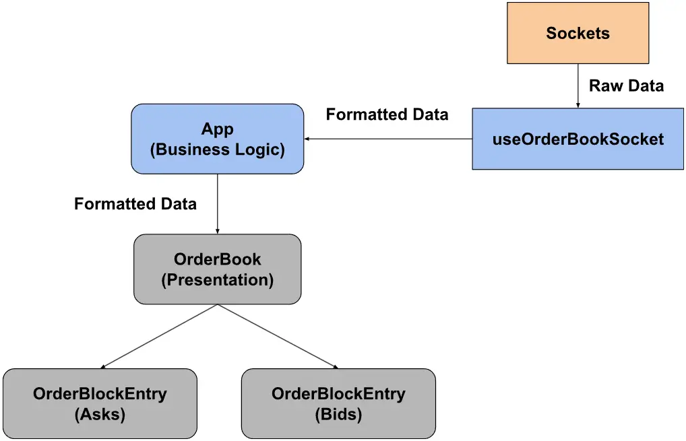

## Environment:
Node 18

## Tech Stack:
1. Vite (Provide quick hot reload)
2. TypeScript (Avoid runtime errors)
3. TailwindCSS (Improve CSS workflow)
4. Prettier (Enforce consistent coding style)

## App Structure:
In order to create an isolated component that is reusable across the whole app, the component is divided into two layers, the business layer that handles the business logic and the presentation layer that handles the rendering logic. In the business layer, the implementation details of the socket and data manipulations are extracted to the ```useOrderBookSocket``` hook for the sake of the separation of concern.
<div align="center">
  
</div>

## Data Structure:
Upon setting the order book data from the initial snapshot, the data is subjected to constant updates due to changes in price level and total size. There are three scenarios that should be considered when new data arrives.

Case 1: Update existing price level 

Case 2: Add new price level 

Case 3: Delete existing price level

All scenarios require checking whether the price level exists or not. Hence, using a hash map to record the price level would provide a constant access time complexity of O(1). Also, another ordered array is needed to store the sequence of the price level.
```
const priceSizeMap = {
  [key: number]: number
}
const priceSequence = number[]
```

### Case 1: Update existing price level:
1. Check for existing price level in ```priceSizeMap``` O(1)
2. Update existing price level in ```priceSizeMap``` O(1)
3. Calculate new accumulated total size O(n)

```Time complexity = O(n)```

### Case 2: Add new price level:
1. Check for existing price level in ```priceSizeMap``` O(1)
2. Add new price level in ```priceSizeMap``` O(1)
3. Binary search the insertion index in ```priceSequence``` O(log(n))
4. Insert price level in ```priceSequence``` O(n)
5. Calculate new accumulated total size O(n)
   
```Time complexity = O(n)```

### Case 3: Delete existing price level:
1. Check for existing price level in ```priceSizeMap``` O(1)
2. Delete the price level from ```priceSizeMap``` O(1)
3. Binary search the removal index in ```priceSequence``` O(log(n))
4. Delete the price level from ```priceSequence``` O(n)
5. Calculate new accumulated total size O(n)
   
```Time complexity = O(n)```

## Challenges faced
One of the challenges I faced was that occasionally the socket would return data that tried to delete a price level that was not registered in the hashmap, which caused a lot of confusion and errors. I had to open the developer tool to put breakpoints at each line of code to see what was happening underneath the code. In addition, sometimes the socket would return inconsistent string data like ```"100.00"``` instead of ```"100"```, which also incurred a lot of errors. 

## Possible improvements
The application is a minimum viable product, there are a lot of improvements in terms of responsiveness and accessibility. Also, the data returned by the socket is sorted in an ascending order, which can be taken advantage of to enhance the time complexity when performing insertion and removal at the priceSequence array. In addition, it is recommended to conduct unit testing by writing test cases to prevent potential bugs that might introduce in the future when the component is subjected to further changes.
