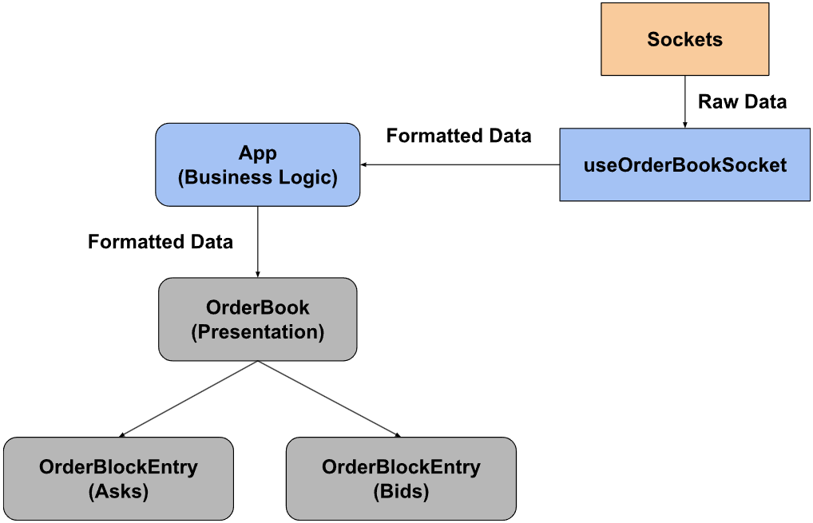

## Environment:
Node 18

## Tech Stack:
1. Vite (Provide quick hot reload)
2. TypeScript (Avoid runtime errors)
3. TailwindCSS (Improve CSS workflow)
4. Prettier (Enforce consistent coding style)

## App Structure:
In order to create an isolated component that is reusable across the whole app, the component is divided into two layers, the business layer that handles the business logic and the presentation layer that handles the rendering logic. In the business layer, the implementation details of the socket and data manipulations are extracted to the ```useOrderBookSocket``` hook for the sake of the separation of concern.
<div align="center">
  
</div>
